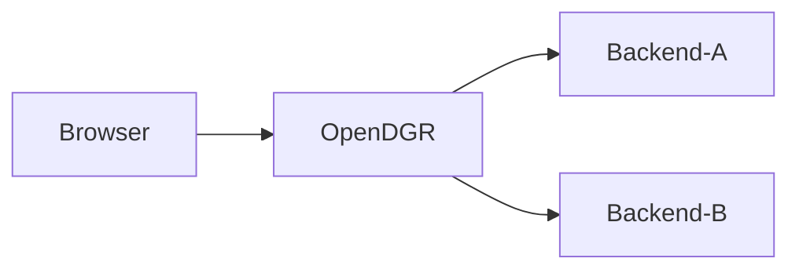

[![][tpi-logo]][tpi-url]
# Your API Gateway for Microservices
[TPI.dev](https://tpi.dev/home) | [Documentation](https://docs.tpi.dev/) | [Blog](https://tpi.dev/blog)
## Table of contents
- [Overview](#overview)
- [Quick Start](#quick-start)
- [Create a Simple Api Proxy](#create-a-simple-api-proxy)
- [Documentation](#documentation)
- [Build Your Own JAR](#build-your-own-jar)
- [Run digiRunner in a Local Container Registry](#run-digirunner-in-a-local-container-registry)

## Overview
digiRunner is an application-layer API gateway that acts as a central hub for communication between clients and your backend services in a microservices architecture. It simplifies frontend development by providing a unified API endpoint, streamlining interactions with your distributed backend services.

## Key Features:

- Intelligent Routing: Routes API requests efficiently to the appropriate backend service based on request content.
- Robust Security: Provides multi-layered authentication and authorization to protect your APIs from attacks.
- Real-time Monitoring: Monitors API performance with detailed data for proactive issue identification and resolution.
- Traffic Management: Ensures system stability by setting limits on API access frequency and quotas.

## Benefits of digiRunner:

- Simplified Frontend Development: Provides a single API entry point, reducing development complexity.
- Enhanced System Stability: Ensures reliability through traffic control and error handling.
- Improved System Security: Offers multiple security mechanisms to safeguard your system.
- Facilitated Microservices Governance: Enables unified management and control of your microservices through API management.

## Common Use Cases:

- Consolidate multiple backend services into a single, easily accessible API.
- Implement robust access control to protect your APIs from unauthorized access.
- Gain insights into API usage patterns through detailed monitoring data.
- Enforce rate limiting to prevent API overload and ensure system stability.
- Transform API outputs into various formats like JSON or XML for broader client compatibility.

## Service Structure



## Quick Start

### 1. Using Container

choose one of the following options to launch service by container

#### Option 1: Docker

```shell
docker run -it -d -p 31080:18080 tpisoftwareopensource/digirunner-open-source
```

#### Option 2: Docker-Compose

```yml
name: digirunner-open-source
services:
    dgr:
        image: tpisoftwareopensource/digirunner-open-source
        ports:
            - "31080:18080"
        environment:
            - TZ=Asia/Taipei
```

- save above configuration to `opendgr-compose.yml`
- run `docker-compose -f opendgr-compose.yml up -d` at the same directory with `opendgr-compose.yml`

#### Option 3: Kubernetes

```yml
apiVersion: v1
kind: Namespace
metadata:
  name: digirunner-open-source-ns

---

apiVersion: v1
kind: Service
metadata:
  name: digirunner-open-source-svc
  namespace: digirunner-open-source-ns
spec:
  ports:
    - name: tcp
      nodePort: 31080
      port: 18080
      protocol: TCP
      targetPort: 18080
  selector:
    app: digirunner
  sessionAffinity: None
  type: NodePort

---

apiVersion: apps/v1
kind: Deployment
metadata:
  labels:
    app: digirunner
  name: digirunner-open-source-deploy
  namespace: digirunner-open-source-ns
spec:
  replicas: 1
  selector:
    matchLabels:
      app: digirunner
  template:
    metadata:
      labels:
        app: digirunner
      namespace: digirunner-open-source-ns
    spec:
      containers:
        - env:
            - name: TZ
              value: Asia/Taipei
          image: tpisoftwareopensource/digirunner-open-source
          imagePullPolicy: Always
          name: digirunner
          ports:
            - containerPort: 18080
              name: tcp
              protocol: TCP
          workingDir: /opt/digirunner
```

- save above configuration to `digirunner-open-source.yml`
- run `kubectl apply -f digirunner-open-source.yml`

#### Connect to service

- Open your browser and navigate to: http://localhost:31080/dgrv4/login
- Use the default credentials to login: 
  - username: `manager`
  - password: `manager123`

### 2. Run Your Own Build

### Pre-requisites

- OpenJDK 17+

---

1. Clone the repository: 
    ```sh
    git clone https://github.com/TPIsoftwareOSPO/digiRunner-Open-Source.git
    ```
2. Change directory:
    ```shell
    cd digiRunner-Open-Source/
    ```
3. Run the service:
    ```sh
    ./gradlew :dgrv4_Gateway_serv:bootRun
    ```

4. Wait for the digiRunner banner to appear.

 ```
      _       ____                                      _  _   
   __| | __ _|  _ \ _   _ _ __  _ __   ___ _ __  __   __ || |  
  / _` |/ _` | |_) | | | | '_ \| '_ \ / _ \ '__| \ \ / / || |_ 
 | (_| | (_| |  _ <| |_| | | | | | | |  __/ |     \ V /|__   _|
  \__,_|\__, |_| \_\\__,_|_| |_|_| |_|\___|_|      \_/    |_|  
        |___/                                                  
========== dgRv4 web server info ============
...
```

5. Open your browser and navigate to: http://localhost:18080/dgrv4/login
6. Use the default credentials to login: 
   - username: `manager`
   - password: `manager123`

## Create a Simple API Proxy

- [Documentation/create_a_simple_api_proxy](https://docs.tpi.dev/get-started/registering-your-first-apis-with-digirunner)

## Documentation

- [Documentation](https://docs.tpi.dev/)

## Build Your Own JAR

1. Change to digiRunner directory:
    ```sh
    cd digiRunner/
    ```
2. Build the JAR: 
    ```sh
    ./gradlew :dgrv4_Gateway_serv:clean :dgrv4_Gateway_serv:bootJar
    ```
   
3. Locate the JAR file: `dgrv4_Gateway_serv/build/libs/digiRunner-{version}.jar`
4. Run the JAR:
    ```sh
    java -jar dgrv4_Gateway_serv/build/libs/digiRunner-{version}.jar --digiRunner.token.key-store.path=$PWD/dgrv4_Gateway_serv/keys
    ```

## Run digiRunner in a Local Container Registry

### 1. Build the Image

#### Change to digiRunner directory:

```sh
cd digiRunner/
```
#### Build the Docker image:

```sh
docker build -t digirunner .
```

### 2. Run the container

```sh
docker run -p 18080:18080 digirunner
```

Open your browser and navigate to: http://localhost:18080/dgrv4/login

## Makefile

You can also build your own jar using the `make` command

### Usage

`make [task]`

tasks:
- `license-report`: generate dependencies license report to license-report.html
- `build-jar`: execute gradlew clean and than build, result in dgrv4_Gateway_serv/build/libs/digiRunner-v4.2.25.jar
- `java-run`: run digiRunner-v4.2.25.jar using java -jar command
- `build-image`: build docker image
- `run-container`: run docker container


[tpi-url]: https://tpi.dev/home
[tpi-logo]: https://www.tpisoftware.com/images/products/digirunner/aws/v2/logo01@2x.png

