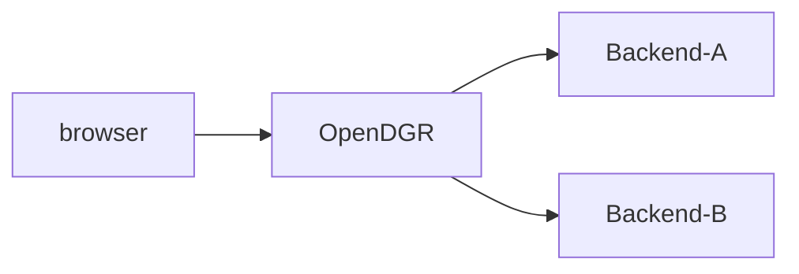

# OpenDGR: Your API Gateway for Microservices

OpenDGR is an application-layer API gateway that acts as a central hub for communication between clients and your backend services in a microservices architecture. It simplifies frontend development by providing a unified API endpoint, streamlining interactions with your distributed backend services.

## Key Features:

- Intelligent Routing: Routes API requests efficiently to the appropriate backend service based on request content.
- Robust Security: Provides multi-layered authentication and authorization to protect your APIs from attacks.
- Real-time Monitoring: Monitors API performance with detailed data for proactive issue identification and resolution.
- Traffic Management: Ensures system stability by setting limits on API access frequency and quotas.

## Benefits of OpenDGR:

- Simplified Frontend Development: Provides a single API entry point, reducing development complexity.
- Enhanced System Stability: Ensures reliability through traffic control and error handling.
- Improved System Security: Offers multiple security mechanisms to safeguard your system.
- Facilitated Microservices Governance: Enables unified management and control of your microservices through API management.

## Common Use Cases:

- Consolidate multiple backend services into a single, easily accessible API.
- Implement robust access control to protect your APIs from unauthorized access.
- Gain insights into API usage patterns through detailed monitoring data.
- Enforce rate limiting to prevent API overload and ensure system stability.
- Transform API outputs into various formats like JSON or XML for broader client compatibility.

## Service Structure



## Pre-requisites

- OpenJDK 17+
   ```shell
   java --version
   openjdk 17.0.12 2024-07-16 LTS
   ...
   ```

## Quick Start

### 1. Using Docker

```shell
docker run -it -d -p 18080:18080 tpisoftwareopensource/opendgr
```

- Open your browser and navigate to: http://localhost:18080/dgrv4/login
- Use the default credentials to login: 
  - username: `manager`
  - password: `manager123`

### 2. Run Your Own Build

1. Clone the repository: 
    ```sh
    git clone https://github.com/TPIsoftwareOSPO/digiRunner.git
    ```
2. Change directory:
    ```shell
    cd digiRunner/
    ```
3. Run the service:
    ```sh
    ./gradlew :dgrv4_Gateway_serv:bootRun
    ```

4. Wait for the OpenDGR banner to appear.

   ```
            _______                   _____                    _____                    _____                    _____                    _____                    _____          
           /::\    \                 /\    \                  /\    \                  /\    \                  /\    \                  /\    \                  /\    \         
          /::::\    \               /::\    \                /::\    \                /::\____\                /::\    \                /::\    \                /::\    \        
         /::::::\    \             /::::\    \              /::::\    \              /::::|   |               /::::\    \              /::::\    \              /::::\    \       
        /::::::::\    \           /::::::\    \            /::::::\    \            /:::::|   |              /::::::\    \            /::::::\    \            /::::::\    \      
       /:::/~~\:::\    \         /:::/\:::\    \          /:::/\:::\    \          /::::::|   |             /:::/\:::\    \          /:::/\:::\    \          /:::/\:::\    \     
      /:::/    \:::\    \       /:::/__\:::\    \        /:::/__\:::\    \        /:::/|::|   |            /:::/  \:::\    \        /:::/  \:::\    \        /:::/__\:::\    \    
     /:::/    / \:::\    \     /::::\   \:::\    \      /::::\   \:::\    \      /:::/ |::|   |           /:::/    \:::\    \      /:::/    \:::\    \      /::::\   \:::\    \   
    /:::/____/   \:::\____\   /::::::\   \:::\    \    /::::::\   \:::\    \    /:::/  |::|   | _____    /:::/    / \:::\    \    /:::/    / \:::\    \    /::::::\   \:::\    \  
   |:::|    |     |:::|    | /:::/\:::\   \:::\____\  /:::/\:::\   \:::\    \  /:::/   |::|   |/\    \  /:::/    /   \:::\ ___\  /:::/    /   \:::\ ___\  /:::/\:::\   \:::\____\ 
   |:::|____|     |:::|    |/:::/  \:::\   \:::|    |/:::/__\:::\   \:::\____\/:: /    |::|   /::\____\/:::/____/     \:::|    |/:::/____/  ___\:::|    |/:::/  \:::\   \:::|    |
    \:::\    \   /:::/    / \::/    \:::\  /:::|____|\:::\   \:::\   \::/    /\::/    /|::|  /:::/    /\:::\    \     /:::|____|\:::\    \ /\  /:::|____|\::/   |::::\  /:::|____|
     \:::\    \ /:::/    /   \/_____/\:::\/:::/    /  \:::\   \:::\   \/____/  \/____/ |::| /:::/    /  \:::\    \   /:::/    /  \:::\    /::\ \::/    /  \/____|:::::\/:::/    / 
      \:::\    /:::/    /             \::::::/    /    \:::\   \:::\    \              |::|/:::/    /    \:::\    \ /:::/    /    \:::\   \:::\ \/____/         |:::::::::/    /  
       \:::\__/:::/    /               \::::/    /      \:::\   \:::\____\             |::::::/    /      \:::\    /:::/    /      \:::\   \:::\____\           |::|\::::/    /   
        \::::::::/    /                 \::/____/        \:::\   \::/    /             |:::::/    /        \:::\  /:::/    /        \:::\  /:::/    /           |::| \::/____/    
         \::::::/    /                   ~~               \:::\   \/____/              |::::/    /          \:::\/:::/    /          \:::\/:::/    /            |::|  ~|          
          \::::/    /                                      \:::\    \                  /:::/    /            \::::::/    /            \::::::/    /             |::|   |          
           \::/____/                                        \:::\____\                /:::/    /              \::::/    /              \::::/    /              \::|   |          
            ~~                                               \::/    /                \::/    /                \::/____/                \::/____/                \:|   |          
                                                              \/____/                  \/____/                  ~~                                                \|___|          
                                                                                                                                                                                  
   ========== dgRv4 web server info ============
   ...
   ```

5. Open your browser and navigate to: http://localhost:18080/dgrv4/login
6. Use the default credentials to login: 
   - username: `manager`
   - password: `manager123`

## Create a Simple API Proxy

- [Documentation/create_a_simple_api_proxy](#)

## Documentation

- [Docs on gitbook](#)

## Build Your Own JAR

1. Change to digiRunner directory:
    ```sh
    cd digiRunner/
    ```
2. Build the JAR: 
    ```sh
    ./gradlew clean :dgrv4_Gateway_serv:bootJar
    ```
3. Locate the JAR file: `dgrv4_Gateway_serv/build/libs/opendgr-{version}.jar`
4. Run the JAR:
    ```sh
    java -jar dgrv4_Gateway_serv/build/libs/opendgr-*.jar
    ```

## Run OpenDGR in a Local Container Registry

### 1. Build the Image

#### Change to digiRunner directory:

```sh
cd digiRunner/
```
#### Build the Docker image:

```sh
docker build -t opendgr .
```

### 2. Run the container

```sh
docker run -p 18080:18080 opendgr
```

Open your browser and navigate to: http://localhost:18080/dgrv4/login
